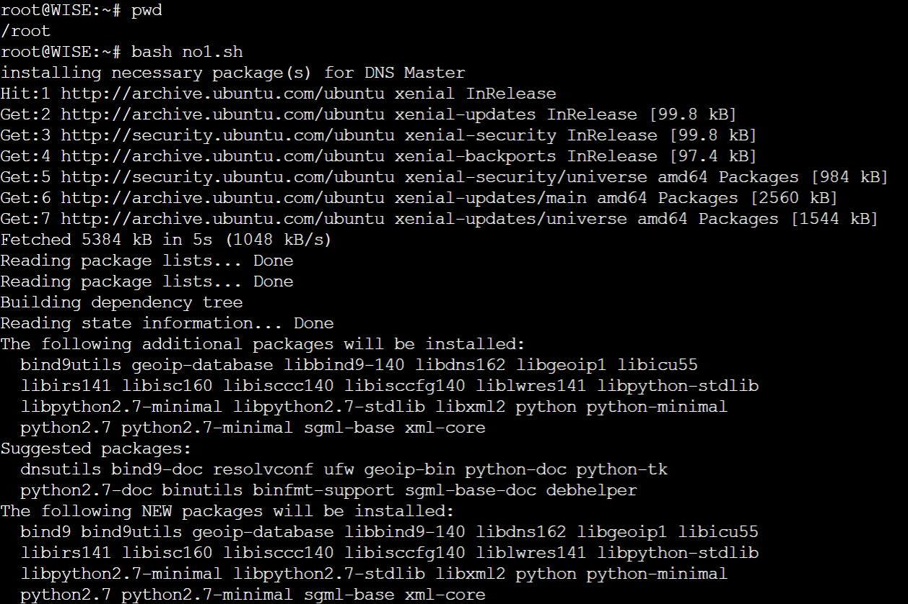

# Jarkom-Modul-2-B01-2022

Anggota :
> Ichsanul Aulia - 05111840007001\
> Alfin Indrawan - 5025201199\
> Graidy Megananda - 5025201188

---
## Tabel Konten
- [Pembagian tugas](#pembagian-tugas)
- [Soal 1](#nomor-1)
- [Soal 2](#nomor-2)
- [Soal 3](#nomor-3)
- [Soal 4](#nomor-4)
- [Soal 5](#nomor-5)
- [Soal 6](#nomor-6)
- [Soal 7](#nomor-7)
- [Soal 8](#nomor-8)
- [Soal 9](#nomor-9)
- [Soal 10](#nomor-10)
- [Soal 11](#nomor-11)
- [Soal 12](#nomor-12)
- [Soal 13](#nomor-13)
- [Soal 14](#nomor-14)
- [Soal 15](#nomor-15)
- [Soal 16](#nomor-16)
- [Soal 17](#nomor-17)
- [Kesulitan](#kesulitan)

## Pembagian Tugas
> Ichsanul Aulia - 7 hingga 11\
> Alfin Indrawan - 1 hingga 6\
> Graidy Megananda - 12 hingga

## Nomor 1
### Soal
WISE akan dijadikan sebagai DNS Master, Berlint akan dijadikan DNS Slave, dan Eden akan digunakan sebagai Web Server. Terdapat 2 Client yaitu SSS, dan Garden. Semua node terhubung pada router Ostania, sehingga dapat mengakses internet (1).

### Penyelesaian
1. Klik ```servers``` di kiri atas.
2. Klik ```local```.
3. Klik ```Add blank project```.
4. Masukkan nama ```project``` yang diinginkan.
5. Klik ```Add project```.
6. Klik tombol `Add a node` di samping kiri.
7. Lalu tarik `ubuntu-1` ke area kosong di halaman.
8. Tunggu hingga proses loading selesai.
9. Klik kanan pada note dan `change hostname` menjadi `Ostania`
10. Klik kanan kembali dan `change symbol` menjadi symbol `router`
11. Lakukanlah langkah 6 hingga 9 untuk node `SSS`, `Garden`, `WISE`, `Berlint`, dan `Eden`.
12. Klik tombol `Add a node` di samping kiri.
13. Tarik `NAT` dan dua `Switch` ke area kosong di halaman.
14. Klik `Add a Link` dan tambahkan link untuk menghubungkan setiap node dan switch.
15. Kita perlu melakukan setting network pada masing-masing node dengan fitur `Edit network configuration`, untuk konfigurasi network pada masing - masing node diisi dengan setting sebagai berikut :
- Ostania
```
auto eth0
iface eth0 inet dhcp

auto eth1
iface eth1 inet static
	address 192.173.1.1
	netmask 255.255.255.0

auto eth2
iface eth2 inet static
	address 192.173.2.1
	netmask 255.255.255.0

auto eth3
iface eth2 inet static
	address 192.173.3.1
	netmask 255.255.255.0
```
- SSS
```
auto eth0
iface eth0 inet static
	address 192.173.1.2
	netmask 255.255.255.0
	gateway 192.173.1.1
```
- Garden
```
auto eth0
iface eth0 inet static
	address 192.173.1.3
	netmask 255.255.255.0
	gateway 192.173.1.1
```
- WISE
```
auto eth0
iface eth0 inet static
	address 192.173.2.2
	netmask 255.255.255.0
	gateway 192.173.2.1
```
- Berlint
```
auto eth0
iface eth0 inet static
	address 192.173.3.2
	netmask 255.255.255.0
	gateway 192.173.3.1
```
- Eden
```
auto eth0
iface eth0 inet static
	address 192.173.3.3
	netmask 255.255.255.0
	gateway 192.173.3.1
```
16. Restart semua node. Dihasilkan topologi sebagai berikut: <br/>

<br/>
17. Topologi sudah bisa berjalan secara lokal, namun untuk mengakses jaringan keluar maka perlu dilakukan beberapa konfigurasi sebagai berikut :
- Ketikkan command berikut pada console router `Ostania`:
```
cd
bash enable-internet.sh
```
- Pada node `SSS`, `WISE`, `Berlint`, dan `Eden` ketikkan command berikut:
```
cd
bash no1.sh
```
Catatan: node `Garden` tidak dilakukan apa-apa karena peran `client` sudah diwakilkan oleh node `SSS`.

### Penjelasan File .sh
1. enable-internet.sh pada `Ostania`
- Command berikut digunakan untuk menghubungkan router Ostania ke internet
```
iptables -t nat -A POSTROUTING -o eth0 -j MASQUERADE -s 192.173.0.0/16
echo nameserver 192.168.122.1 > /etc/resolv.conf
```

2. no1.sh
- Pada `SSS`, digunakan untuk install package `dnsutils` dan `lynx`, serta untuk setting nameserver. <br/>
```
echo -e '
nameserver 192.173.2.2
nameserver 192.168.122.1
' > /etc/resolv.conf

echo 'downloading necessary package'
sleep 1

apt-get update
apt-get install dnsutils -y
apt-get install lynx -y
```


- Pada `WISE` `dan `berlint`, digunakan untuk install package `bind9` serta setting nameserver.
```
echo "installing necessary package(s) for DNS Master"
echo nameserver 192.168.122.1 > /etc/resolv.conf
apt-get update
apt-get install bind9 -y
```



- Pada `berlint` digunakan untuk install package `bind9` serta setting nameserver.
```
echo -e '
echo "installing necessary package(s) for DNS Slave"
echo nameserver 192.168.122.1 > /etc/resolv.conf
apt-get update
apt-get install bind9 -y
```


- Pada `Eden`, digunakan untuk install package `apache2`, `php`, `libapache2-mod-php7.0`, `unzip`, dan `git`; serta setting nameserver.
```
echo "installing necessary package(s) for Web Server"
echo nameserver 192.168.122.1 > /etc/resolv.conf
apt-get update
apt-get install apache2 -y
apt-get install libapache2-mod-php7.0 -y
apt-get install php -y
apt-get install unzip -y
apt-get install git -y
```


<br/>
## Nomor 2
### Soal
Untuk mempermudah mendapatkan informasi mengenai misi dari Handler, bantulah Loid membuat website utama dengan akses wise.yyy.com dengan alias www.wise.yyy.com pada folder wise
<br/>
### Penyelesaian
- Pada wise (file `no2.sh`)
  - Membuat file `no2.sh` pada root dan mengisinya dengan hal-hal berikut:<br/>
  - Membuat zone "wise.b01.com" pada file named.conf.local
```
echo -e '
zone "wise.b01.com" {
        type master;
        file "/etc/bind/wise/wise.b01.com";
};
 ' > /etc/bind/named.conf.local
```
<br/>

  - Membuat folder wise
```
mkdir /etc/bind/wise
```
  - Menyalin file `db.local` ke dalam folder `wise` dan menamakannya `wise.b01.com`
```
cp /etc/bind/db.local /etc/bind/wise/wise.b01.com
```
  - Melakukan konfigurasi file `wise.b01.com`
```
echo -e '
;
; BIND data file for local loopback interface
;
$TTL    604800
@       IN      SOA     wise.b01.com. root.wise.b01.com. (
                        2               ; Serial
                        604800          ; Refresh
                        86400           ; Retry
                        2419200         ; Expire
                        604800 )        ; Negative Cache TTL
;
@       IN      NS      wise.b01.com.
@       IN      A       192.173.3.3
www     IN      CNAME   wise.b01.com.
@       IN      AAAA    ::1
' > /etc/bind/wise/wise.b01.com
```

<br/>

## Nomor 3
### Soal
### Penyelesaian
### Penjelasan File .sh

## Nomor 4
### Soal
### Penyelesaian
### Penjelasan File .sh

## Nomor 5
### Soal
### Penyelesaian
### Penjelasan File .sh

## Nomor 6
### Soal
### Penyelesaian
### Penjelasan File .sh

## Nomor 7
### Soal
### Penyelesaian
### Penjelasan File .sh

## Nomor 8
### Soal
### Penyelesaian
### Penjelasan File .sh

## Nomor 9
### Soal
### Penyelesaian
### Penjelasan File .sh

## Nomor 10
### Soal
### Penyelesaian
### Penjelasan File .sh

## Nomor 11
### Soal
### Penyelesaian
### Penjelasan File .sh

## Nomor 12
### Soal
### Penyelesaian
### Penjelasan File .sh

## Nomor 13
### Soal
### Penyelesaian
### Penjelasan File .sh

## Nomor 14
### Soal
### Penyelesaian
### Penjelasan File .sh

## Nomor 15
### Soal
### Penyelesaian
### Penjelasan File .sh

## Nomor 16
### Soal
### Penyelesaian
### Penjelasan File .sh

## Nomor 17
### Soal
### Penyelesaian
### Penjelasan File .sh
