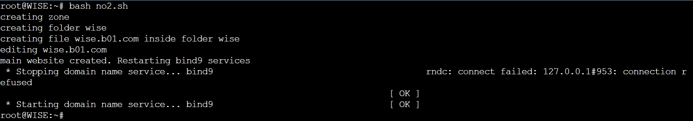

# Jarkom-Modul-2-B01-2022

Anggota :
> Ichsanul Aulia - 05111840007001\
> Alfin Indrawan - 5025201199\
> Graidy Megananda - 5025201188

---
## Tabel Konten
- [Pembagian tugas](#pembagian-tugas)
- [Soal 1](#nomor-1)
- [Soal 2](#nomor-2)
- [Soal 3](#nomor-3)
- [Soal 4](#nomor-4)
- [Soal 5](#nomor-5)
- [Soal 6](#nomor-6)
- [Soal 7](#nomor-7)
- [Soal 8](#nomor-8)
- [Soal 9](#nomor-9)
- [Soal 10](#nomor-10)
- [Soal 11](#nomor-11)
- [Soal 12](#nomor-12)
- [Soal 13](#nomor-13)
- [Soal 14](#nomor-14)
- [Soal 15](#nomor-15)
- [Soal 16](#nomor-16)
- [Soal 17](#nomor-17)
- [Kesulitan](#kesulitan)

## Pembagian Tugas
> Ichsanul Aulia - 7 hingga 11\
> Alfin Indrawan - 1 hingga 6\
> Graidy Megananda - 12 hingga

## Nomor 1
### Soal
WISE akan dijadikan sebagai DNS Master, Berlint akan dijadikan DNS Slave, dan Eden akan digunakan sebagai Web Server. Terdapat 2 Client yaitu SSS, dan Garden. Semua node terhubung pada router Ostania, sehingga dapat mengakses internet (1).

### Penyelesaian
1. Klik ```servers``` di kiri atas.
2. Klik ```local```.
3. Klik ```Add blank project```.
4. Masukkan nama ```project``` yang diinginkan.
5. Klik ```Add project```.
6. Klik tombol `Add a node` di samping kiri.
7. Lalu tarik `ubuntu-1` ke area kosong di halaman.
8. Tunggu hingga proses loading selesai.
9. Klik kanan pada note dan `change hostname` menjadi `Ostania`
10. Klik kanan kembali dan `change symbol` menjadi symbol `router`
11. Lakukanlah langkah 6 hingga 9 untuk node `SSS`, `Garden`, `WISE`, `Berlint`, dan `Eden`.
12. Klik tombol `Add a node` di samping kiri.
13. Tarik `NAT` dan dua `Switch` ke area kosong di halaman.
14. Klik `Add a Link` dan tambahkan link untuk menghubungkan setiap node dan switch.
15. Kita perlu melakukan setting network pada masing-masing node dengan fitur `Edit network configuration`, untuk konfigurasi network pada masing - masing node diisi dengan setting sebagai berikut :
- Ostania
```
auto eth0
iface eth0 inet dhcp

auto eth1
iface eth1 inet static
	address 192.173.1.1
	netmask 255.255.255.0

auto eth2
iface eth2 inet static
	address 192.173.2.1
	netmask 255.255.255.0

auto eth3
iface eth2 inet static
	address 192.173.3.1
	netmask 255.255.255.0
```
- SSS
```
auto eth0
iface eth0 inet static
	address 192.173.1.2
	netmask 255.255.255.0
	gateway 192.173.1.1
```
- Garden
```
auto eth0
iface eth0 inet static
	address 192.173.1.3
	netmask 255.255.255.0
	gateway 192.173.1.1
```
- WISE
```
auto eth0
iface eth0 inet static
	address 192.173.2.2
	netmask 255.255.255.0
	gateway 192.173.2.1
```
- Berlint
```
auto eth0
iface eth0 inet static
	address 192.173.3.2
	netmask 255.255.255.0
	gateway 192.173.3.1
```
- Eden
```
auto eth0
iface eth0 inet static
	address 192.173.3.3
	netmask 255.255.255.0
	gateway 192.173.3.1
```
16. Restart semua node. Dihasilkan topologi sebagai berikut: <br/>

<br/>
17. Topologi sudah bisa berjalan secara lokal, namun untuk mengakses jaringan keluar maka perlu dilakukan beberapa konfigurasi sebagai berikut :
- Ketikkan command berikut pada console router `Ostania`:
```
cd
bash enable-internet.sh
```
- Pada node `SSS`, `WISE`, `Berlint`, dan `Eden` ketikkan command berikut:
```
cd
bash no1.sh
```
Catatan: node `Garden` tidak dilakukan apa-apa karena peran `client` sudah diwakilkan oleh node `SSS`.

### Penjelasan File .sh
1. enable-internet.sh pada `Ostania`
- Command berikut digunakan untuk menghubungkan router Ostania ke internet
```
iptables -t nat -A POSTROUTING -o eth0 -j MASQUERADE -s 192.173.0.0/16
echo nameserver 192.168.122.1 > /etc/resolv.conf
```

2. no1.sh
- Pada `SSS`, digunakan untuk install package `dnsutils` dan `lynx`, serta untuk setting nameserver. <br/>
```
echo -e '
nameserver 192.173.2.2
nameserver 192.168.122.1
' > /etc/resolv.conf

echo 'downloading necessary package'
sleep 1

apt-get update
apt-get install dnsutils -y
apt-get install lynx -y
```


- Pada `WISE` `dan `berlint`, digunakan untuk install package `bind9` serta setting nameserver.
```
echo "installing necessary package(s) for DNS Master"
echo nameserver 192.168.122.1 > /etc/resolv.conf
apt-get update
apt-get install bind9 -y
```


- Pada `berlint` digunakan untuk install package `bind9` serta setting nameserver.
```
echo "installing necessary package(s) for DNS Slave"
echo nameserver 192.168.122.1 > /etc/resolv.conf
apt-get update
apt-get install bind9 -y
```


- Pada `Eden`, digunakan untuk install package `apache2`, `php`, `libapache2-mod-php7.0`, `unzip`, dan `git`; serta setting nameserver.
```
echo "installing necessary package(s) for Web Server"
echo nameserver 192.168.122.1 > /etc/resolv.conf
apt-get update
apt-get install apache2 -y
apt-get install libapache2-mod-php7.0 -y
apt-get install php -y
apt-get install unzip -y
apt-get install git -y
```


<br/>
## Nomor 2
### Soal
Untuk mempermudah mendapatkan informasi mengenai misi dari Handler, bantulah Loid membuat website utama dengan akses wise.yyy.com dengan alias www.wise.yyy.com pada folder wise
<br/>
### Penyelesaian
1. Di `wise`, membuat file `no2.sh` pada root dan mengisinya dengan hal-hal berikut:<br/>
- Membuat zone "wise.b01.com" pada file named.conf.local
```
echo -e '
zone "wise.b01.com" {
        type master;
        file "/etc/bind/wise/wise.b01.com";
};
 ' > /etc/bind/named.conf.local
```
<br/>

- Membuat folder wise
```
mkdir /etc/bind/wise
```
- Menyalin file `db.local` ke dalam folder `wise` dan menamakannya `wise.b01.com`
```
cp /etc/bind/db.local /etc/bind/wise/wise.b01.com
```
- Melakukan konfigurasi file `wise.b01.com`
```
echo -e '
;
; BIND data file for local loopback interface
;
$TTL    604800
@       IN      SOA     wise.b01.com. root.wise.b01.com. (
                        2               ; Serial
                        604800          ; Refresh
                        86400           ; Retry
                        2419200         ; Expire
                        604800 )        ; Negative Cache TTL
;
@       IN      NS      wise.b01.com.
@       IN      A       192.173.3.3
www     IN      CNAME   wise.b01.com.
@       IN      AAAA    ::1
' > /etc/bind/wise/wise.b01.com
```

- Merestart bind9 dengan command `service bind9 restart` <br/><br/>
Foto ketika file `no2.sh` dijalankan



2. Untuk check, membuat file `no2-check.sh` pada `SSS` (client), lalu mengisinya dengan command berikut:<br/>
- setting nameserver
```
echo '
nameserver 192.173.2.2          //IP WISE
nameserver 192.173.3.2          //IP Berlint
nameserver 192.168.122.1
' > /etc/resolv.conf
```

- ping domain `wise.b01.com` dengan `ping wise.b01.com -c 5`
- cek alias `www.wise.b01.com` dengan `host -t CNAME www.wise.b01.com`
- ping alias `www.wise.b01.com` dengan `pinging www.wise.b01.com` <br/><br/>
Foto ketika file `no2-check.sh` dijalankan

<br/>

## Nomor 3
### Soal
Setelah itu ia juga ingin membuat subdomain eden.wise.yyy.com dengan alias www.eden.wise.yyy.com yang diatur DNS-nya di WISE dan mengarah ke Eden
<br/>
### Penyelesaian
1. Di `wise`, membuat file `no3.sh` pada root dan mengisinya dengan hal-hal berikut:<br/>
- Menambahkan subdomain pada file `wise.b01.com`
```
...
@       IN      NS      wise.b01.com.
@       IN      A       192.173.3.3
www     IN      CNAME   wise.b01.com.
eden    IN      A       192.173.3.3     ;IP Eden
www.eden        IN      CNAME   eden.wise
@       IN      AAAA    ::1
' > /etc/bind/wise/wise.b01.com
```
- Merestart bind9 dengan command `service bind9 restart` <br/><br/>
Foto ketika file `no2.sh` dijalankan


2. Untuk check, membuat file `no3-check.sh` pada `SSS` (client), lalu mengisinya dengan command berikut:<br/>
- ping `eden.wise.b01.com` dengan command `ping eden.wise.b01.com -c 5`
- check alias `www.eden.wise.b01.com` dengan command `host -t CNAME www.eden.wise.b01.com`
- ping alias dengan command `ping www.eden.wise.b01.com -c 5` <br/><br/>
Foto ketika file `no3-check.sh` dijalankan

<br/>

## Nomor 4
### Soal
Buat juga reverse domain untuk domain utama <br/>
### Penyelesaian
1. Di `wise`, membuat file `no4.sh` pada root dan mengisinya dengan hal-hal berikut:<br/>
- Menambahkan zone "3.173.192.in-addr.arpa" pada `/etc/bind/named.conf.local`
```
zone "3.173.192.in-addr.arpa" {
    type master;
    file "/etc/bind/wise/3.173.192.in-addr.arpa";
};
```

- Menyalin file `db.local` ke dalam folder `wise` dan menamakannya `3.173.192.in-addr.arpa`
```
cp /etc/bind/db.local /etc/bind/wise/3.173.192.in-addr.arpa
```
- Melakukan konfigurasi file `3.173.192.in-addr.arpa`
```
;
; BIND data file for local loopback interface
;
$TTL    604800
@       IN      SOA     wise.b01.com. root.wise.b01.com. (
                        2               ; Serial
                        604800          ; Refresh
                        86400           ; Retry
                        2419200         ; Expire
                        604800 )        ; Negative Cache TTL
;
3.173.192.in-addr.arpa.         IN      NS      wise.b01.com.
3                               IN      PTR       wise.b01.com.
```
- Merestart bind9 dengan command `service bind9 restart` <br/><br/>
Foto ketika file `no4.sh` dijalankan

<br/>

2. Untuk check, membuat file `no4-check.sh` pada `SSS` (client), lalu mengisinya dengan command berikut: <br/>
- check reverse DNS dengan command `host -t PTR 192.173.3.3` <br/><br/>
Foto ketika file `no4-check.sh` dijalankan

<br/>

## Nomor 5
### Soal
Agar dapat tetap dihubungi jika server WISE bermasalah, buatlah juga Berlint sebagai DNS Slave untuk domain utama
### Penyelesaian
1. Di `wise`, membuat file `no5.sh` pada root dan mengisinya dengan hal-hal berikut:<br/>
- allow notify dan transfer pada konfigurasi zone "wise.b01.com"
```
notify yes;
also-notify { 192.173.3.2; };           //IP Berlint
allow-transfer { 192.173.3.2; };        //IP Berlint
```
- Setelah file dengan nama yang sama, yaitu `no5.sh`, pada berlint telah selesai dijalankan, mematikan service bind9
```
echo 'Stopping bind9 services? (y)'
read var
sleep 1
service bind9 stop
service bind9 status
```
Foto ketika file `no5.sh` dijalankan

<br/>

2. Di `berilnt`, membuat file `no5.sh` pada root dan mengisinya dengan hal-hal berikut:<br/>
- Membuat konfigurasi zone "wise.b01.com" pada file `named.conf.local`
```
echo -e '
zone "wise.b01.com" {
        type slave;
        masters { 192.173.2.2; }; // IP WISE
        file "/var/lib/bind/wise.b01.com";
};
' > /etc/bind/named.conf.local
```
- Merestart bind9 dengan command `service bind9 restart` <br/><br/>
Foto ketika file `no5.sh` dijalankan

<br/>

3. Untuk check, membuat file `no5-check.sh` pada `SSS` (client), lalu mengisinya dengan command berikut:<br/>
- `ping wise.b01.com -c 5` <br/><br/>
Foto ketika file `no5-check.sh` dijalankan

<br/>

## Nomor 6
### Soal
Karena banyak informasi dari Handler, buatlah subdomain yang khusus untuk operation yaitu operation.wise.yyy.com dengan alias www.operation.wise.yyy.com yang didelegasikan dari WISE ke Berlint dengan IP menuju ke Eden dalam folder operation
### Penyelesaian
1. Di `wise`, membuat file `no6.sh` pada root dan mengisinya dengan hal-hal berikut:<br/>
- Melakukan konfigurasi domain `operation.wise.b01.com` pada file `wise.b01.com`
```
@       IN      NS      wise.b01.com.
@       IN      A       192.173.3.3
www     IN      CNAME   wise.b01.com.
eden    IN      A       192.173.3.3     ;IP Eden
www.eden.wise.b01.com.  IN      CNAME   eden.wise.b01.com.
ns1     IN      A       192.173.3.2     ;IP Berlint
operation       IN      NS      ns1
@       IN      AAAA    ::1
```
- Mengomen `dnssec-validation auto;` dan menambahkan command `allow-query{any;};` pada file `named.conf.options`
```
echo -e '
options {
        directory "/var/cache/bind";
        //dnssec-validation auto;
        allow-query{any;};
        auth-nxdomain no;    # conform to RFC1035
        listen-on-v6 { any; };
};
' > /etc/bind/named.conf.options
```
- Merestart bind9 dengan command `service bind9 restart` <br/><br/>
Foto ketika file `no6.sh` dijalankan

<br/>

2. Di `berilnt`, membuat file `no6.sh` pada root dan mengisinya dengan hal-hal berikut:<br/>
- Mengomen `dnssec-validation auto;` dan menambahkan command `allow-query{any;};` pada file `named.conf.options`
```
echo -e '
options {
        directory "/var/cache/bind";
        //dnssec-validation auto;
        allow-query{any;};
        auth-nxdomain no;    # conform to RFC1035
        listen-on-v6 { any; };
};
' > /etc/bind/named.conf.options
```
- Melakukan konfigurasi zone "operation.wise.b01.com" pada file `named.conf.local`
```
echo -e '
zone "operation.wise.b01.com" {
        type master;
        file "/etc/bind/operation/operation.wise.b01.com";
};
' > /etc/bind/named.conf.local
```

- Membuat folder `operation` dengan command `mkdir /etc/bind/operation`
- Menyalin file `db.local` ke dalam folder `operation` dan menamakannya `operation.wise.b01.com`
```
cp /etc/bind/db.local /etc/bind/wise/wise.b01.com
```

- Melakukan konfigurasi file `operation.wise.b01.com`
```
echo 'editing file operation.wise.b01.com'
sleep 1
echo -e '
$TTL    604800
@       IN      SOA     operation.wise.b01.com. root.operation.wise.b01.com. (
                              2         ; Serial
                         604800         ; Refresh
                          86400         ; Retry
                        2419200         ; Expire
                        604800 )       ; Negative Cache TTL
;
@       IN      NS      operation.wise.b01.com.
@       IN      A       192.173.3.3
www     IN      CNAME   operation.wise.b01.com.
' > /etc/bind/operation/operation.wise.b01.com
```

- Merestart bind9 dengan command `service bind9 restart` <br/><br/>
Foto ketika file `no6.sh` dijalankan

<br/>

3. Untuk check, membuat file `no6-check.sh` pada `SSS` (client), lalu mengisinya dengan command berikut:<br/>
- Ping domain baru dengan `ping operation.wise.b01.com -c 5`
- Check alias dengan `host -t CNAME www.operation.wise.b01.com`
- Ping alias dengan `ping www.operation.wise.b01.com -c 5` <br/><br/>
Foto ketika file `no6-check.sh` dijalankan

<br/>

## Nomor 7
### Soal
Untuk informasi yang lebih spesifik mengenai Operation Strix, buatlah subdomain melalui Berlint dengan akses strix.operation.wise.yyy.com dengan alias www.strix.operation.wise.yyy.com yang mengarah ke Eden
### Penyelesaian
1. Di `berilnt`, membuat file `no7.sh` pada root dan mengisinya dengan hal-hal berikut:<br/>
- Menambahkan konfigurasi sub-domain pada file `operation.wise.b01.com`
```
echo -e '
$TTL    604800
@       IN      SOA     operation.wise.b01.com. root.operation.wise.b01.com. (
                              2         ; Serial
                         604800         ; Refresh
                          86400         ; Retry
                        2419200         ; Expire
                        604800 )       ; Negative Cache TTL
;
@       IN      NS      operation.wise.b01.com.
@       IN      A       192.173.3.3
www     IN      CNAME   operation.wise.b01.com.
strix   IN      A       192.173.3.3
www.strix       IN      CNAME   strix
' > /etc/bind/operation/operation.wise.b01.com
```
- Merestart bind9 dengan command `service bind9 restart` <br/><br/>
Foto ketika file `no6.sh` dijalankan

<br/>

2. Untuk check, membuat file `no7-check.sh` pada `SSS` (client), lalu mengisinya dengan command berikut:<br/>
- Ping domain baru dengan `ping strix.operation.wise.b01.com -c 5`
- Check alias dengan `host -t CNAME www.strix.operation.wise.b01.com`
- Ping alias dengan `ping www.strix.operation.wise.b01.com -c 5` <br/><br/>
Foto ketika file `no7-check.sh` dijalankan

<br/>

## Nomor 8
### Soal
Setelah melakukan konfigurasi server, maka dilakukan konfigurasi Webserver. Pertama dengan webserver www.wise.yyy.com. Pertama, Loid membutuhkan webserver dengan DocumentRoot pada /var/www/wise.yyy.com
### Penyelesaian
1. Di `Eden`
- Membuat file `wise.b01.com.conf` pada `/etc/apache2/sites-available`
```
cp /etc/apache2/sites-available/000-default.conf /etc/apache2/sites-available/wise.b01.com.conf
```
- Mengonfigurasi file `wise.b01.com.conf`
```
echo -e '
<VirtualHost *:80>
        ServerAdmin webmaster@localhost
        DocumentRoot /var/www/wise.b01.com
        ServerName wise.b01.com
        ServerAlias www.wise.b01.com

        ErrorLog ${APACHE_LOG_DIR}/error.log
        CustomLog ${APACHE_LOG_DIR}/access.log combined
</VirtualHost>
' > /etc/apache2/sites-available/wise.b01.com.conf
```
- Menyalakan konfigurasi `wise.b01.com.conf` dengan `a2ensite wise.b01.com.conf`
- Menyalakan service `apache2` dengan `service apache2 restart`
- Mendownload assets web dan menyimpannya ke `/root`
```
git config --global http.sslVerify false
git clone https://github.com/Graidy27/Jarkom-Modul-2-B01-2022.git
```
- Meng-unzip assets
```
unzip Jarkom-Modul-2-B01-2022/assets/eden.wise.zip
unzip Jarkom-Modul-2-B01-2022/assets/strix.operation.wise.zip
unzip Jarkom-Modul-2-B01-2022/assets/wise.zip
```

- Menghapus file yang tidak diperlukan dengan `rm -r Jarkom-Modul-2-B01-2022`
- Menyalin folder `wise` dan seluruh isinya ke `/var/www` dan mengubah namanya menjadi `wise.b01.com`
```cp -r wise /var/www/wise.b01.com```<br/>
Foto ketika file `no8.sh` dijalankan

<br/>

2. Untuk check, membuat file `no8-check.sh` pada `SSS` (client), lalu mengisinya dengan command `lynx www.wise.b01.com`<br/><br/>
Foto ketika file `no8-check.sh` dijalankan

<br/>

## Nomor 9
### Soal
Setelah itu, Loid juga membutuhkan agar url www.wise.yyy.com/index.php/home dapat menjadi menjadi www.wise.yyy.com/home
### Penyelesaian
1. Di `Eden`
- Menyalakan a2enmod rewrite dengan `a2enmod rewrite`
- Menambahkan konfigurasi berikut pada file `wise.b01.com.conf`
```
<Directory /var/www/wise.b01.com>
	Options +FollowSymLinks -Multiviews
	AllowOverride All
</Directory
```
- Membuat file `.htaccess` di dalam folder `wise.b01.com` dan mengisinya dengan command berikut
```
echo 'RewriteEngine On
RewriteEngine On
RewriteCond %{REQUEST_FILENAME} !-d
RewriteRule ^([^\.]+)$ index.php/$1 [NC,L]
' > /var/www/wise.b01.com/.htaccess
```
- Menjalankan ulang service `apache2` dengan `service apache2 restart` <br/><br/>
Foto ketika file `no9.sh` dijalankan

<br/>


2. Untuk check, membuat file `no9-check.sh` pada `SSS` (client), lalu mengisinya dengan command `lynx www.wise.b01.com/home`<br/><br/>
Foto ketika file `no9-check.sh` dijalankan

<br/>

## Nomor 10
### Soal
Setelah itu, pada subdomain www.eden.wise.yyy.com, Loid membutuhkan penyimpanan aset yang memiliki DocumentRoot pada /var/www/eden.wise.yyy.com
### Penyelesaian
1. Di `Eden`
- Membuat file `eden.wise.b01.com.conf` pada `/etc/apache2/sites-available`
```
cp /etc/apache2/sites-available/000-default.conf /etc/apache2/sites-available/eden.wise.b01.com.conf
```
- Mengonfigurasi file `eden.wise.b01.com.conf`
```
echo -e '
<VirtualHost *:80>
        ServerAdmin webmaster@localhost
        DocumentRoot /var/www/eden.wise.b01.com
        ServerName eden.wise.b01.com
        ServerAlias www.eden.wise.b01.com

        ErrorLog ${APACHE_LOG_DIR}/error.log
        CustomLog ${APACHE_LOG_DIR}/access.log combined
</VirtualHost>
' > /etc/apache2/sites-available/eden.wise.b01.com.conf
```
- Menyalakan konfigurasi `eden.wise.b01.com.conf` dengan `a2ensite eden.wise.b01.com.conf`
- Menjalankan ulang service `apache2` dengan `service apache2 restart` <br/><br/>
- Menyalin folder `eden.wise` dan seluruh isinya ke `/var/www` dan mengubah namanya menjadi `eden.wise.b01.com`
```cp -r eden.wise /var/www/eden.wise.b01.com``` <br/>
Foto ketika file `no10.sh` dijalankan

<br/>


2. Untuk check, membuat file `no10-check.sh` pada `SSS` (client), lalu mengisinya dengan command `lynx www.eden.wise.b01.com`<br/><br/>
Foto ketika file `no10-check.sh` dijalankan

<br/>

## Nomor 11
### Soal
Akan tetapi, pada folder /public, Loid ingin hanya dapat melakukan directory listing saja
### Penyelesaian
1. Di `Eden`
- Menambahkan code berikut pada file `eden.wise.b01.com.conf`
```
<Directory /var/www/eden.wise.b01.com/public>
	Options +Indexes
</Directory>
```
- Menjalankan ulang service `apache2` dengan `service apache2 restart` <br/><br/>
Foto ketika file `no11.sh` dijalankan

<br/>


2. Untuk check, membuat file `no11-check.sh` pada `SSS` (client), lalu mengisinya dengan command `lynx www.eden.wise.b01.com/public`<br/><br/>
Foto ketika file `no11-check.sh` dijalankan

<br/>

## Nomor 12
### Soal
Tidak hanya itu, Loid juga ingin menyiapkan error file 404.html pada folder /error untuk mengganti error kode pada apache
### Penyelesaian
1. Di `Eden`
- Menambahkan code berikut pada file `eden.wise.b01.com.conf`
```
ErrorDocument 404 /error/404.html
```
- Menjalankan ulang service `apache2` dengan `service apache2 restart` <br/><br/>
Foto ketika file `no12.sh` dijalankan

<br/>


2. Untuk check, membuat file `no12-check.sh` pada `SSS` (client), lalu mengisinya dengan command `lynx www.eden.wise.b01.com/yor_forger`<br/><br/>
Foto ketika file `no12-check.sh` dijalankan

<br/>

## Nomor 13
### Soal
Loid juga meminta Franky untuk dibuatkan konfigurasi virtual host. Virtual host ini bertujuan untuk dapat mengakses file asset www.eden.wise.yyy.com/public/js menjadi www.eden.wise.yyy.com/js
### Penyelesaian
1. Di `Eden`
- Menambahkan code berikut pada file `eden.wise.b01.com.conf`
```
Alias "/js" "/var/www/eden.wise.b01.com/public/js"
```
- Menjalankan ulang service `apache2` dengan `service apache2 restart` <br/><br/>
Foto ketika file `no13.sh` dijalankan

<br/>


2. Untuk check, membuat file `no13-check.sh` pada `SSS` (client), lalu mengisinya dengan command `lynx www.eden.wise.b01.com/js`<br/><br/>
Foto ketika file `no13-check.sh` dijalankan

<br/>

## Nomor 14
### Soal
Loid meminta agar www.strix.operation.wise.yyy.com hanya bisa diakses dengan port 15000 dan port 15500
### Penyelesaian
1. Di `Eden`
- Membuat file `strix.operation.wise.b01.com.conf` pada `/etc/apache2/sites-available`
```
cp /etc/apache2/sites-available/000-default.conf /etc/apache2/sites-available/.wise.b01.com.conf
```
- Mengonfigurasi file `strix.operation.wise.b01.com.conf`
```
echo -e '
<VirtualHost *:15000 *:15500>
        ServerAdmin webmaster@localhost
        DocumentRoot /var/www/strix.operation.wise.b01.com
        ServerName strix.operation.wise.b01.com
        ServerAlias www.strix.operation.wise.b01.com

        ErrorLog ${APACHE_LOG_DIR}/error.log
        CustomLog ${APACHE_LOG_DIR}/access.log combined
</VirtualHost>
' > /etc/apache2/sites-available/strix.operation.wise.b01.com.conf
```
- Menyalakan konfigurasi `strix.operation.wise.b01.com.conf` dengan `a2ensite strix.operation.wise.b01.com.conf`
- Menyalin folder `strix.operation.wise` dan seluruh isinya ke `/var/www` dan mengubah namanya menjadi `strix.operation.wise.b01.com`
```cp -r strix.operation.wise /var/www/strix.operation.wise.b01.com```
- Menambahkan port 15000 dan 15500 pada file `ports.conf` di path `/etc/apache2/`
```
Listen 15000
Listen 15500
```
- Menjalankan ulang service `apache2` dengan `service apache2 restart` <br/><br/>
Foto ketika file `no14.sh` dijalankan

<br/>


2. Untuk check, membuat file `no14-15-check.sh` pada `SSS` (client), lalu mengisinya dengan command `
```
lynx http://192.173.3.3:15000
lynx http://192.173.3.3:15500
```
Foto ketika file `no14-15-check.sh` dijalankan

(baik port 15000 maupun 15500 menampilkan hal yang sama) <br/><br/>

## Nomor 15
### Soal
dengan autentikasi username Twilight dan password opStrix dan file di /var/www/strix.operation.wise.yyy
### Penyelesaian
1. Di `Eden`
- Menambahkan command berikut ke dalam konfigurasi file `strix.operation.wise.b01.com.conf`
```
<Directory "/var/www/strix.operation.wise.b01.com">
	AuthType Basic
	AuthName "Restricted Content"
	AuthUserFile /etc/apache2/.htpasswd
	Require valid-user
</Directory>
```
- Membuat file user `Twiight` dengan menggunakan command `htpasswd -c /etc/apache2/.htpasswd Twilight`. Pada saat diminta memasukkan password, masukkan `opStrix`
- Menjalankan ulang service `apache2` dengan `service apache2 restart` <br/><br/>
Foto ketika file `no15.sh` dijalankan

<br/>


2. Untuk check, membuat file `no14-15-check.sh` pada `SSS` (client), lalu mengisinya dengan command `
```
lynx http://192.173.3.3:15000
lynx http://192.173.3.3:15500
```
Foto ketika file `no14-15-check.sh` dijalankan
<br/>
<br/>
<br/>
<br/>

(baik port 15000 maupun 15500 menampilkan hal yang sama) <br/><br/>

## Nomor 16
### Soal
dan setiap kali mengakses IP Eden akan dialihkan secara otomatis ke www.wise.yyy.com
### Penyelesaian
1. Di `Eden`
- Membuat file `.htaccess` di dalam folder `/var/www/html` dan mengisinya dengan command berikut
```
echo 'RewriteEngine On
RewriteBase /
RewriteCond %{HTTP_HOST} ^192\.173\.3\.3$
RewriteRule ^(.*)$ http://www.wise.b01.com/$1 [L,R=301]
' > /var/www/html/.htaccess
```
- Menambahkan command berikut ke dalam konfigurasi file `000-default.conf` di dalam folder `/etc/apache2/sites-available/`
```
<Directory /var/www/html>
	AllowOverride All
</Directory>
```
- Menjalankan ulang service `apache2` dengan `service apache2 restart` <br/><br/>
Foto ketika file `no16.sh` dijalankan

<br/>


2. Untuk check, membuat file `no16-check.sh` pada `SSS` (client), lalu mengisinya dengan command `lynx http://192.173.3.3`<br/><br/>
Foto ketika file `no16-check.sh` dijalankan

<br/>

## Nomor 17
### Soal
Karena website www.eden.wise.yyy.com semakin banyak pengunjung dan banyak modifikasi sehingga banyak gambar-gambar yang random, maka Loid ingin mengubah request gambar yang memiliki substring “eden” akan diarahkan menuju eden.png. Bantulah Agent Twilight dan Organisasi WISE menjaga perdamaian!
### Penyelesaian
1. Di `Eden`
- Membuat file `.htaccess` di dalam folder `/var/www/eden.wise.b01.com/` dan mengisinya dengan command berikut
```
echo '
RewriteEngine On
RewriteCond %{REQUEST_FILENAME} !-d
RewriteRule ^(.*)eden(.*)$ /public/images/eden.png [R=301,L]
#RewriteRule ^(.*)eden(.*)$ /public/images/eden-student.jpg [R=301,L]
' > /var/www/eden.wise.b01.com/.htaccess
```
- Menambahkan command berikut ke dalam konfigurasi file `eden.wise.b01.com.conf` di dalam folder `/etc/apache2/sites-available/`
```
<Directory /var/www/eden.wise.b01.com>
	AllowOverride All
</Directory>
```
- Menjalankan ulang service `apache2` dengan `service apache2 restart` <br/><br/>
Foto ketika file `no17.sh` dijalankan

<br/>


2. Untuk check, membuat file `no17.sh` pada `SSS` (client), lalu mengisinya dengan command `lynx eden.wise.b01.com/public/images/eden-student`<br/><br/>
Foto ketika file `no17.sh` dijalankan
 <br/>
 <br/>
<br/>
